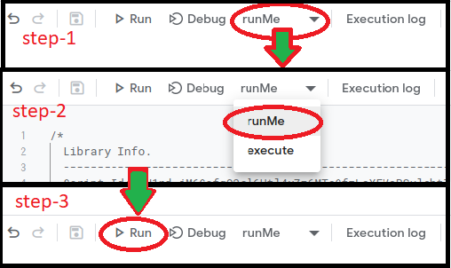

# About [reg-email-system.gs](./reg-email-system.gs)

This script can send an automated email fed by the *google form-owner* to the *google form-submitter*.

### What will you need?

  1. A ***Google Form*** and a ***Google Sheets*** that is connected to the ***Google Form***.

  2. A ***Google Docs*** file that has the email body written in it.

  3. Optional: A ***Folder*** in your google drive to organize and maintain easily. If you use this folder then keep the files mentioned in 1. and 2. in this folder.

### How to activate?

  1. Open the spreadsheet I mention earlier.

  2. Now from the ribbon go to `Tools` > `Script editor`. This will open an editor in a new tab.

  3. Delete what ever is written in the editor and paste the code from [reg-email-system.gs](./reg-email-system.gs) file.

  4. Now from the editor click the '+' icon beside `Libraries` (should be at the left).

  5. A window will pop up with a title **Add a Library**. In the prompt you have to paste the script id.
    The current   
    **script id:** `1PvbQZoE804UdpINDPeuTJeu-vrYFd7gzkZNnZCmsqGHgwECpzKh-aoZC`  
    Now click on **Look up**.  This should find the library.
    From the drop down menu under *Version* select the **latest** (currently: 9).
    Keep the **Identifier** as it is. and click on *Add* button.

  6. Now hit `ctrl + s` from your keyboard. Thats it. (You can also save a project name if you want, not mendatory)
  7. Now run the `runMe` function. You have to run this function **only the first time ever**. Follow this: 
  8. Now go to the spreadsheet, refresh it and close it.

### How to use?
  After the code is successfully injected, you can send use the form normally. The difference is, after submission each user will recieve an email.
  

##### If you find/face any problem feel free to let me know at sshifat022@gmail.com or submit an [issue](https://github.com/s-shifat/Automation-Scripts/issues).
